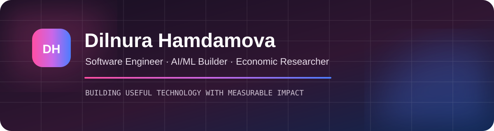

  

  
  
  

## 👋 About me

- 💻 Software Engineer working with backend systems and AI-enabled products
- 🤖 Building at the intersection of **AI/ML, product engineering, and research**

## 🧰 Technology stack

  

`Java` · `Spring Boot` · `Python` · `FastAPI` · `PostgreSQL` · `REST APIs` · `AI/ML` · `Docker` · `Git` · `CI/CD` · `R` · `Econometrics`

## 🚀 Featured projects

| Project | What it does | Stack |
|---|---|---|
| [**HujjatAI**](https://github.com/DilnuraHamdamova/hujjat-ai-bot) | Multilingual Telegram product for creating CVs, documents, and portfolio websites | Python · FastAPI · PostgreSQL |
| [**Smart Belt**](https://github.com/DilnuraHamdamova/SmartBelt-Project) | Wearable safety concept with real-time monitoring | IoT · Android · Safety Tech |
| [**Tashkent Property Predictor**](https://github.com/DilnuraHamdamova/tashkent-apartment-price-predictor) | Evidence-first apartment price guidance with reproducible ML evaluation | Python · ML · FastAPI |
| [**Evidence RAG Assistant**](https://github.com/DilnuraHamdamova/evidence-rag-assistant) | Citation-first document assistant with evaluation and observability | RAG · NLP · Docker |

## 📊 GitHub activity

  
  

  

---

<i>Turning bold ideas into useful technology and measurable impact.</i>

